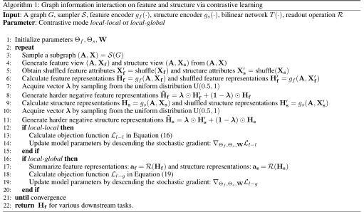

# Graph Information Interaction on Feature and Structure via Contrastive Learning

>This is an anonymous repository supporting the submission 278 of WWW-2022.

## Requirements

- python==3.7
- numpy==1.19.2
- torch==1.7.1
- torch-geometric==1.7.0
- scikit-learn==0.23.2
- scipy==1.5.4
- matplotlib==3.4.1
- networkx==2.5

## Training

To learn node representations by GII algorithm, run this command:

```train
python train_fsc.py
```

>📋  At present, only the implement of using node degree as structure attributes is provided. We will provide the completed code later.

## Overview

The repository is organized as follows:

- `data/` contains the dataset files;

- `embeddings/` saves the learned representations by GII algorithm;

- `losses/` saves the losses during training;

- `images/` contains the images supporting this document;

- `dataset.py` is responsible for preprocessing data;

- `utils.py` contains the necessary processing subroutines;

- `train_fsc.py` is the main program to run the GII algorithm (at present, only the implement of using node degree as structure attributes is provided);

- `t-SNE.py` visualizes the learned representations of GII by t-SNE algorithm. To visualize,  run

  ```
  python t-SNE.py  -dataset "<name_of_dataset>"  -rep_file  "<name_of_representation_file>"
  ```

## Dataset

- Cora, Citeseer and Pubmed are citation networks with nodes corresponding to documents and edges representing citation relationships. Each document has a class label indicating subject category and is associated with a bag-of-words feature vector.
- Amazon-Computers and Amazon-Photo are two graphs constructed from Amazon, representing co-purchase relationships. The nodes indicate goods, and an edge is established between two nodes which are frequently bought together. A sparse bag-of-words feature about product reviews describes each node. The label of each node indicates its category.
- Coauthor-CS is an academic network, where nodes represent authors and edges denote co-authorship. Two authors are linked if they are involved in a paper together.
- ACM  is an academic network, where the nodes represent the papers and there is an edge between two papers having co-authors. The papers are divided into three classes (database, wireless communication, and data mining) based on their research area.

|     Dataset      | Type                  | #Nodes | #Features | #Edges  | #Classes |
| :--------------: | --------------------- | :----: | :-------: | :-----: | :------: |
|       Cora       | Citation network      | 2,708  |   1,433   |  5,429  |    7     |
|     Citeseer     | Citation network      | 3,327  |   3,707   |  4,732  |    6     |
|      Pubmed      | Citation network      | 19,717 |    500    | 44,338  |    3     |
| Amazon-Computers | Co-purchase network   | 13,752 |    767    | 245,861 |    10    |
|   Amazon-Photo   | Co-purchase network   | 7,650  |    745    | 119,081 |    8     |
|   Coauthor-CS    | Co-authorship network | 18,333 |   6,805   | 81,894  |    15    |
|       ACM        | Academic network      | 3,025  |   1,870   | 13,128  |    3     |

## Additional Visual Experiments

- Visual experiments on Citeseer dataset are as follows:

  

- Visual experiments on ACM dataset are as follows. An interesting phenomenon is that the learned representations on ACM dataset via various contrastive schemes present two different forms. Compared with the local-local contrastive scheme, the visual results of the local-global contrastive scheme present greater intra-cluster affinity. This is partly because the local-global scheme regards the global representation as a center point and considers the relationship between the global representation and the local representations, making the learned node representations close to the center point to make them more compact.


## Experiments on Objective Functions

To further understand three objective functions in the main text, we visualize the changes of three loss functions during training on Cora and Pubmed datasets. It can be observed that our local-global contrastive scheme using adjacency matrix as structure attributes converges fastest and achieve the optimal solution firstly on both experimental datasets. The local-global contrastive losses drop fastest in the early stage of training, while the local-local contrastive losses and the original GAN-like losses change smoothly. Compared with node degree, using adjacency matrix as structure attribute achieves smaller value finally, illustrating the dependency between node feature and adjacency matrix is larger than that between node feature and node degree.


We conduct experimental studies for the three objective functions of the main text on node classification task. In general, the local-global contrastive scheme achieves the best performance, followed by the local-local contrastive scheme, and the original GAN-like loss function has the worst results. The experimental results demonstrate the effectiveness of our proposed mixing-based negative sampling strategy.


## Hyperparameter Settings

All experiments run on a server with Intel(R) Xeon(R) Gold 6230 CPU @2.10GHz and Tesla V100-PCIE-32GB  in CentOS Linux release 7.6.1810.  The hyperparameter settings for various datasets are as follows:

|     Dataset      | Learning rate | Maximum training epochs | Patience | Hidden dim | Activation |
| :--------------: | :-----------: | :---------------------: | :------: | :--------: | :--------: |
|       Cora       |     0.001     |          3,000          |    20    |    512     |   PReLU    |
|     Citeseer     |     0.001     |          3,000          |    20    |    512     |   PReLU    |
|      Pubmed      |     0.001     |          4,000          |    40    |    256     |   PReLU    |
| Amazon-Computers |     0.001     |          2,000          |    20    |    256     |   PReLU    |
|   Amazon-Photo   |     0.001     |          2,000          |    20    |    256     |   PReLU    |
|   Coauthor-CS    |     0.001     |          2,000          |    20    |    256     |   PReLU    |
|       ACM        |     0.001     |          2,000          |    20    |    512     |   PReLU    |

## Overall Workflow

The algorithm flow of two contrastive schemes is as follows:




